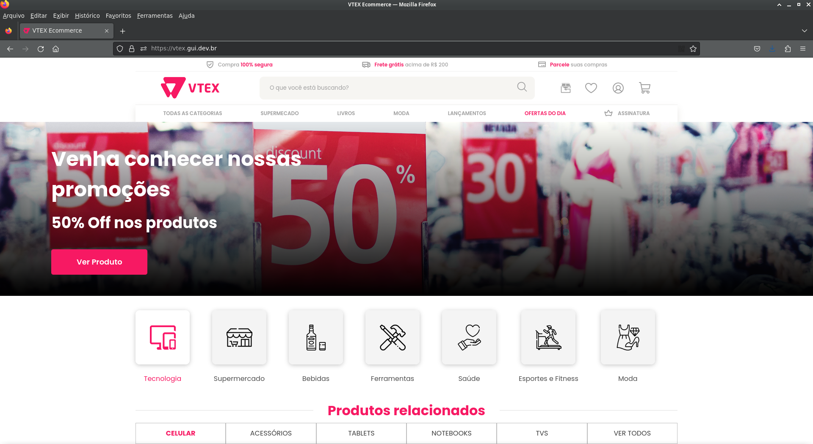

<h1 align="center">
    
</h1>
<p align="center">


<br>
</p>

<p align="justify">
Pagina desenvolvida para o teste da Econverse para a Vaga de Desenvolvedor Front End Jr.</p>

<p align="center">
  <a href="https://vtex.gui.dev.br">
  
  Veja a página no ar!
  </a>
</p>
<h2>👨‍💻 Tecnologias Utilizadas</h2>
<ul>
<li><b>ReactJS:</b> Biblioteca JavaScript para criação de interfaces de usuário.</li>
<li><b>SCSS:</b> Pré-processador de CSS.</li>
</ul>

<h2>📁 Como rodar o projeto</h2>
<p>Antes de começar, você vai precisar ter instalado em sua máquina as seguintes ferramentas:</p>
<ul>
<li><a href="https://git-scm.com">Git</a></li>
<li><a href="https://nodejs.org/en/">Node.js</a></li>
<li><a href="https://yarnpkg.com/">Npm ou Yarn</a></li>
</ul>

<p>Com tudo pronto, siga as instruções abaixo:</p>

```bash
# Clone este repositório
$ git clone https://github.com/gsbenevides2/teste-front-end-jr
# Acesse a pasta do projeto no terminal/cmd
$ cd teste-front-end-jr
# Instale as dependências
$ yarn install
# Execute a aplicação em modo de desenvolvimento
$ yarn dev
```

<h3> Alternativa GitPod</h3>
<p>Para rodar o projeto no GitPod, basta clicar no botão abaixo:</p>
<p align="center">
  <a href="https://gitpod.io/#https://github.com/gsbenevides2/teste-front-end-jr
">
    
    </a>
</p>

<h2>🔗 Links</h2>
<ul>
<li><a href="https://www.figma.com/file/Ye9pI8CcVKDFP4sbH6pJKO/Teste-Front-End-Jr-(Copy)?type=design&node-id=0%3A1&mode=design&t=ZQmIezgtbWlUo5mX-1">Prototipagem do Projeto no Figma</a></li>
</ul>

<hr>
<p align="center">Feito com 🩷 por <a href="https://gui.dev.br">gsbenevides2</a></p>
